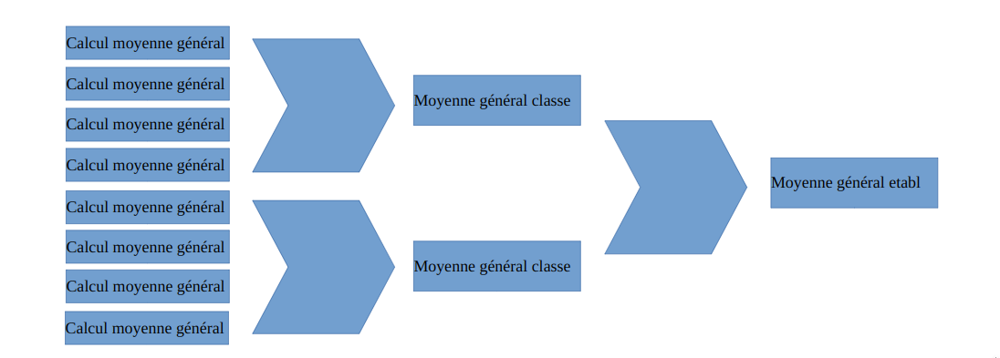

# PyLambdaFlows

## POC branch

Mark reducer using lambda.
This subproject is a proof of concept for this computing library over AWS lambda service.

### Main purpose of Mark reduce
Functional description, step by step :

- General Mean per student :
    - From 32 students result on source/data.csv, We compute a general mean with one lambda per student.
- Class Mean 
    - Then we gather all mean with a second step lambda. One lamnda per class. This lamnbda get all previous result using AWS S3 service.

    - It produce a class mean before calling next step
- School mean
    - This last step is executed by only one lambda call. This lambda receive mean from each classes and perform a big mean.

### Schema

